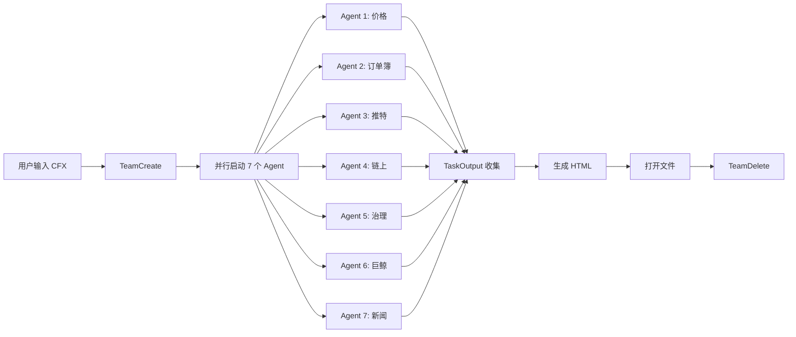
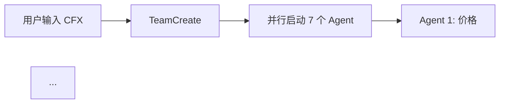

# CFX 投资简报项目

**项目类型**: 自动化投资研究工具
**主要功能**: 生成 Conflux (CFX) 代币的每日投资简报
**技术栈**: Python, Bash, HTML, MCP Servers (Grok API, Chrome DevTools)

## 快速开始

```bash
# 生成 HTML 简报（推荐）
CFX

# 生成 Markdown 简报
CFX --md
```

---

## 项目架构

### 核心组件

1. **CFX Briefing Skill** (`/.claude/skills/cfx-briefing/`)
   - 主入口: `SKILL.md` - 定义简报生成流程
   - 执行模式: Agent Teams 并行架构（7个独立 Agent）
   - 输出格式: HTML（默认）或 Markdown

2. **数据源集成**
   - 价格数据: CoinGecko API
   - 交易所订单簿: Binance, OKX, Gate.io, MEXC
   - 推特舆情: Grok Agent Tools API (xAI)
   - 链上数据: ConfluxScan API (Core Space + eSpace)
   - 治理投票: ConfluxHub (Chrome DevTools MCP)
   - 巨鲸持仓: CoinCarp Rich List

3. **自动化配置**
   - 权限: `settings.local.json` 配置自动执行规则
   - API Keys: `.env` 文件存储敏感凭证
   - 输出目录: `$CFX_PROJECT_DIR/CFX简报_YYYY-MM-DD.html`

---

## 工作流程

### 简报生成流程（全自动，零确认）



**关键原则**:
- ✅ 必须使用 Agent Teams 并行执行
- ✅ 所有 Agent 同时启动（一个 tool call）
- ✅ 主进程禁止直接调用 API
- ✅ 使用 `mode: "bypassPermissions"` 自动执行
- ❌ 禁止串行执行或等待用户确认

---

## API 配置

### Grok API (xAI) - 推特舆情分析

**当前版本**: Agent Tools API (2026-02-05)

```bash
# Endpoint
POST https://api.x.ai/v1/responses

# 请求示例
curl -X POST 'https://api.x.ai/v1/responses' \
  -H 'Authorization: Bearer $XAI_API_KEY' \
  -H 'Content-Type: application/json' \
  -d '{
    "model": "grok-4-1-fast-reasoning",
    "input": [{"role": "user", "content": "查询内容"}],
    "tools": [{"type": "x_search", "allowed_x_handles": ["账号1", "账号2"]}]
  }'
```

**限制**:
- `allowed_x_handles` 最多 10 个账号/请求
- 需分 2 批请求获取全部 16 个监控账号

**已弃用**:
- ~~`/v1/chat/completions`~~ (2026-01-12 停用)
- ~~`grok-3-latest`~~ 模型

---

## 简报内容规范

### 必须包含的 9 个章节

| # | 章节 | 数据源 | 关键指标 |
|---|------|--------|----------|
| 1 | 价格概览 | CoinGecko | 当前价、24h/7d 变化、市值 |
| 2 | 交易所盘口 | 4 交易所 API | 价格、涨跌、成交量 |
| 3 | 治理投票 | ConfluxHub | Round 轮次、4 参数变更 |
| 4 | 巨鲸持仓 | CoinCarp | Top10/20/50/100 占比 |
| 5 | 链上数据 | ConfluxScan | TVL、Core/eSpace 账户 |
| 6 | 推特舆情 | Grok API | 16 账号情绪分析 |
| 7 | 重大新闻 | WebSearch | 交易所、合作、牌照 |
| 8 | 综合评估 | 分析 | 利好/风险/操作建议 |
| 9 | 数据来源 | - | API 来源列表 |

### 输出格式规则

- **默认**: HTML（用户输入 `CFX` 或 `CFX --api`）
- **可选**: Markdown（用户输入 `CFX --md`）
- **禁止**: 跳过任何章节、使用占位符、输出错误格式

---

## 投资背景与策略

### 用户持仓信息

| 项目 | 数值 |
|------|------|
| **成本价** | $0.26 |
| **当前状态** | 浮亏 |
| **投资目标** | 回本并盈利 |

### 止盈策略

| 价格区间 | 操作 | 比例 |
|----------|------|------|
| $0.15 - $0.18 | 第一批止盈 | 30% |
| $0.22 - $0.26 | 第二批止盈 | 40% |
| $0.30+ | 第三批止盈 | 剩余 30% |

### 关键催化剂（按重要性排序）

1. **⭐⭐⭐ 香港稳定币牌照** - 预计 2026年3月首批发放
2. **⭐⭐⭐ Hexbit × Conflux 合作** - 支付产品、RWA、AxCNH 打通
3. **⭐⭐ ConfluxHub 治理投票** - Round 21（PoW温和减产-8.75%、利率翻倍6.52%）
4. **⭐ 山寨季启动** - 比特币周期驱动
5. **⭐ DWF Labs 做市** - 链上动向监控

---

## Conflux 技术架构

### 双空间系统

Conflux 使用**同一个 CFX 代币**，但有两个独立的执行空间：

| 特性 | Core Space | eSpace |
|------|------------|--------|
| **浏览器** | confluxscan.org | evm.confluxscan.net |
| **地址格式** | `cfx:` 开头 | `0x` 开头（EVM 兼容） |
| **总账户** | ~2500万 | ~111万 (2026-02) |
| **日增账户** | 25-75 | 25-100 |
| **DeFi 生态** | 少 | 主要集中地 |
| **稳定币** | 少 | USDT0/AxCNH |

**价值影响**:
- 两个空间的账户增长都对 CFX 有正面影响（Gas 消耗）
- eSpace 增长更能反映生态活跃度（DeFi 交易频繁）
- Core Space 增长反映基础用户增长（持有为主）
- CFX 可在两空间间桥接，总供应量共享

---

## 数据源

### 价格与市场
- CoinGecko API: `https://api.coingecko.com/api/v3/coins/conflux-token`
- CoinCarp: `https://www.coincarp.com/currencies/confluxtoken/`
- DefiLlama: `https://defillama.com/chain/Conflux`

### 链上数据
- Core Space: `https://www.confluxscan.org/`
- eSpace: `https://evm.confluxscan.net/`
- ConfluxScan API: `https://api.confluxscan.io/`

### 交易所
- Binance: `https://api.binance.com/api/v3/ticker/24hr?symbol=CFXUSDT`
- OKX: `https://www.okx.com/api/v5/market/ticker?instId=CFX-USDT`
- Gate.io: `https://api.gateio.ws/api/v4/spot/tickers?currency_pair=CFX_USDT`
- MEXC: `https://api.mexc.com/api/v3/ticker/24hr?symbol=CFXUSDT`

### 治理与社区
- ConfluxHub: `https://confluxhub.io/governance/vote/onchain-dao-voting`
- Twitter 监控: 16 个关键账号（见下方列表）

---

## Twitter 监控账号

### 官方 (2)
- `@Conflux_Network` - 官方主账号
- `@Conflux_Intern` - 内部动态

### 核心团队 (2)
- `@CamillaCaban` - 海外增长负责人
- `@CikeinWeb3` - 国内生态负责人

### 生态项目 (4)
- `@SwappiDEX` - Swappi DEX
- `@OfficialNucleon` - Nucleon
- `@dForcenet` - dForce/Unitus 借贷
- `@BitUnion_Card` - BitUnion U卡

### 生态运营 (2)
- `@Joyzinweb3` - 生态主理人
- `@forgivenever` - Web3 招商

### 合作伙伴 (6)
- `@estherinweb3`
- `@FanLong16`
- `@GuangYang_9`
- `@AnchorX_Ltd` - AxCNH 发行方
- `@HexbitApp` - Hexbit 合作
- `@bxiaokang`

---

## 开发指南

### 修改简报生成逻辑

1. **编辑 Skill 文件**: `/.claude/skills/cfx-briefing/SKILL.md`
2. **测试执行**: `CFX --api`
3. **检查输出**: 打开生成的 HTML 文件
4. **调试失败**: 查看 Agent 输出日志

### 添加新数据源

```bash
# 1. 在 SKILL.md 中添加新 Agent
Task(
  name="agent-8-newdata",
  prompt="获取新数据源...",
  subagent_type="general-purpose",
  mode="bypassPermissions"
)

# 2. 在 TaskOutput 中收集结果
TaskOutput(task_id="agent-8-newdata@team-name")

# 3. 在 HTML 生成中添加新章节
```

### 常见问题

**Q: Agent Teams 执行失败？**
A: 检查 `mode: "bypassPermissions"` 是否设置，确保所有 Agent 在同一个 tool call 中启动

**Q: API 返回 403？**
A: 检查 `.env` 文件中的 API Key，确认 API 配额未超限

**Q: 简报缺少某个章节？**
A: 检查对应 Agent 的输出，可能是数据源失败，需要添加降级逻辑

**Q: 如何调试 Agent 输出？**
A: 查看 `/Users/mac/.claude/teams/cfx-briefing-YYYY-MM-DD/` 目录下的日志

### 性能优化

- ✅ 使用并行 Agent 而非串行执行
- ✅ 设置合理的超时时间（120-180秒）
- ✅ 对失败的 API 调用使用降级方案
- ✅ 缓存不常变化的数据（如治理投票）

---

## 项目文件结构

```
CFX-DWF行情/
├── .claude/
│   └── skills/
│       └── cfx-briefing/
│           ├── SKILL.md          # 主执行逻辑
│           └── @AGENT.md         # Agent 配置
├── scripts/
│   ├── fetch_orderbook.py        # 订单簿脚本
│   └── fetch_axcnh_data.py       # AxCNH 数据脚本
├── .env                          # API Keys
├── CLAUDE.md                     # 本文件
├── CFX投资分析档案.md             # 历史分析
└── CFX简报_YYYY-MM-DD.html       # 输出文件
```

---

## 生态激励活动跟踪

### 项目背景

**Unitus Finance**（原dForce Lending）是一个多链借贷协议，2025年11月在Conflux eSpace上线了USDT0借贷池。

- **官网**：https://unitus.finance/
- **DefiLlama**：https://defillama.com/protocol/unitus
- **文档**：https://docs.dforce.network/dapps/unitus

### 激励活动详情

#### Unitus USDT0借贷池激励

| 指标 | 详情 |
|------|------|
| **开始时间** | 2025年11月27日 14:00 (UTC+8) |
| **持续时间** | 2周 |
| **结束时间** | 约2025年12月11日 |
| **奖励池** | 1,000 CFX |
| **参与方式** | 供应USDT0到Unitus借贷池 |

#### Swappi AxCNH-USDT0流动性激励

| 指标 | 详情 |
|------|------|
| **开始时间** | 2025年12月2日 12:00 (UTC+8) |
| **持续时间** | 2周 |
| **结束时间** | 约2025年12月16日 |
| **奖励池** | 70,000 CFX |
| **参与方式** | 提供AxCNH-USDT0流动性 |

#### dForce AxCNH流动性激励

| 指标 | 详情 |
|------|------|
| **奖励池** | 40,000 CFX |
| **参与方式** | 为AxCNH提供流动性 |

#### 🆕 2026年1月 Unitus AxCNH新激励（2026-01-01更新）

| 指标 | 详情 |
|------|------|
| **开始时间** | 2026年1月2日（周五） |
| **持续时间** | 2周 |
| **结束时间** | 约2026年1月16日 |
| **AxCNH供应商奖励** | **120,000 CFX** |
| **AxCNH借款人奖励** | **55,000 CFX** |
| **总奖励池** | **175,000 CFX（约$12,500）** |
| **参与方式** | 在Unitus供应或借入AxCNH |
| **信息来源** | @dForcenet 12月31日推文 |

#### BitUnion交易补贴（2026-01-01更新）

| 指标 | 详情 |
|------|------|
| **12月补贴总额** | 50,588 CFX（约$3,600） |
| **用途** | 补贴用户交易手续费 |
| **支持方** | Conflux基金会 |
| **信息来源** | @BitUnion_Card 12月31日推文 |

---

## ConfluxHub DAO 链上投票监控（重要！每次简报必查）

> ⚠️ **每次生成简报时必须检查 ConfluxHub 链上治理投票状态！**

### 数据源

| 项目 | 详情 |
|------|------|
| **投票页面** | https://confluxhub.io/governance/vote/onchain-dao-voting |
| **提案页面** | https://confluxhub.io/governance/vote/proposals |
| **数据获取方式** | 使用 Chrome DevTools MCP 浏览器自动化 |

### 链上参数投票（Chain Param Votings）

ConfluxHub 的链上投票允许 CFX 持有者对网络核心参数进行投票，每轮投票持续约60天。

#### 当前投票轮次（Round 21）

| 项目 | 详情 |
|------|------|
| **轮次** | Round 21 |
| **投票期** | 2026-02-06 03:31:02 ~ 2026-04-07 04:31:02 |
| **生效时间** | 2026-06-06 04:31:02 |
| **最低投票权要求** | 41,669,900 票 |

#### 四个核心参数

| 参数 | 当前值 | 即将生效 (R20结果) | 投票中 (R21) | 说明 |
|------|--------|----------|--------|------|
| **PoW Base Block Reward** | 0.80 CFX/Block | 0.40 CFX/Block | **0.73 CFX/Block** | ⚠️ 社区倾向温和减产（-8.75%），而非激进减产 |
| **Interest Rate** | 3.26% | 3.26% | **6.52%** | ⚠️ 质押利率翻倍！激励锁仓 |
| **Storage Point Prop** | 63% | 78% | **87%** | 存储点比例持续上调 |
| **Base Fee Sharing Prop** | 63% | 63% | **77%** | ⚠️ 首次变动！上调至77% |

### 为什么重要？

1. **PoW奖励温和减产**：0.80→0.40（R20已通过）→0.73（R21投票中），社区倾向温和减产而非激进减产（-8.75% vs 之前的-35%）
2. **质押利率翻倍**：3.26%→6.52%，激励更多CFX质押锁仓，减少流通供应
3. **存储点比例持续上调**：63%→78%→87%，影响存储成本和网络经济模型
4. **基础费用分享首次变动**：63%→77%，影响矿工/验证者收入分配
5. **四参数全变**：Round 21社区治理极度活跃，反映高参与度
6. **价格影响**：减产+锁仓激励对CFX供需关系有显著正面影响

### 简报输出要求

每次生成简报时，在**治理投票**章节中，必须包含：

```markdown
### ConfluxHub 链上治理投票

| 参数 | 当前值 | 投票中 | 变化 |
|------|--------|--------|------|
| PoW区块奖励 | [X] CFX | [Y] CFX | [增/减/不变] |
| 质押利率 | [X]% | [Y]% | [增/减/不变] |
| 存储点比例 | [X]% | [Y]% | [增/减/不变] |
| 基础费用分享 | [X]% | [Y]% | [增/减/不变] |

**投票轮次**：Round [N]
**投票截止**：[日期]
**剩余时间**：[X天X小时]
**最低投票权**：[X] 票
```

### 检查方法

1. 使用 Chrome DevTools MCP 访问 https://confluxhub.io/governance/vote/onchain-dao-voting
2. 调用 `mcp__chrome-devtools__take_snapshot` 获取页面快照
3. 解析快照中的投票数据

### 历史记录

| 日期 | 轮次 | PoW奖励 | 利率 | 存储点 | 费用分享 | 备注 |
|------|------|---------|------|--------|----------|------|
| 2026-02-23 | Round 21 | 0.40→0.73 | 3.26%→6.52% | 78%→87% | 63%→77% | 投票中，PoW减产幅度温和化（-8.75%） |
| 2026-02-15 | Round 21 | 0.40→0.26 | 3.26%→6.52% | 78%→87% | 63%→77% | 投票中，四参数全变 |
| 2026-01-21 | Round 20 | 0.80→0.40 | 3.26% | 63%→78% | 63% | ✅ 已结束，结果即将生效 |

---

### 激励效果评估

#### TVL变化（DefiLlama数据）

| 时间 | Unitus TVL | 30天变化 |
|------|------------|----------|
| 2026年2月15日 | $4.49M | 来源: DefiLlama |
| 2025年12月18日 | $3.71M | **+241%** |

#### 账户增长数据

**注意**：Conflux有两个空间，数据分开统计：

| 空间 | 总账户数 | 日增 | 说明 |
|------|----------|------|------|
| **Core Space** | 2500万 | 25-75个 | 老用户为主 |
| **eSpace** | ~111万 (2026-02-15) | 25-100个 | DeFi活动集中 |

**eSpace账户增长（激励相关）**：

| 指标 | 数值 |
|------|------|
| 11月24日总账户 | ~471,000 |
| 12月17日总账户 | ~474,000 |
| 净增账户 | **~3,000个** |
| 平时日增 | 25-100个 |
| 12月8日峰值 | **~2,000个/天** |

> 激励活动（Unitus/Swappi）都在eSpace上，Core Space的日增数据与激励无关

### 分析结论

1. **激励规模较小**：Unitus仅1,000 CFX（约$67），Swappi 70,000 CFX（约$4,700）
2. **TVL增长明显**：Unitus 30天+241%，但绝对值仅$3.71M
3. **账户增长有限**：净增约3,000个账户，峰值单日2,000个
4. **激励驱动为主**：增长主要靠CFX激励，非有机增长
5. **可持续性存疑**：激励结束后TVL是否能保持需观察

### 关键观察点

- [x] ~~Unitus激励结束后（12月11日）TVL是否保持~~ → 已开启新一轮激励
- [x] ~~Swappi激励结束后（12月16日）流动性是否流失~~ → 已开启新一轮激励
- [x] ~~是否有新一轮激励计划~~ → ✅ 1月2日开启175,000 CFX激励
- [x] ~~DIP074投票结果~~ → ✅ 已通过（2026-01-01），USDT0上限$2M→$10M
- [ ] Conflux $5-10M激励计划是否落地
- [ ] 1月激励结束后（约1月16日）TVL是否保持

### 数据源

- Unitus TVL：https://defillama.com/protocol/unitus
- Conflux eSpace统计：https://evm.confluxscan.net/charts
- 官方公告：https://confluxnetwork.medium.com/

---

## AxCNH人民币稳定币供应量监控（2026年2月更新）

> ⚠️ **每次生成简报时必须检查 AxCNH 的链上供应量变化！**

### AxCNH 基本信息

| 项目 | 详情 |
|------|------|
| **代币名称** | AxCNH（离岸人民币稳定币） |
| **发行方** | AnchorX |
| **合约地址** | `0x70bfd7f7eadf9b9827541272589a6b2bb760ae2e` |
| **查询链接** | https://evm.confluxscan.net/token/0x70bfd7f7eadf9b9827541272589a6b2bb760ae2e |

### 供应量历史记录

| 日期 | 总供应量 | 持有人数 | 转移次数 | 备注 |
|------|----------|----------|----------|------|
| 2026-02-15 | **38.128M** | 1,037 | 51,291 | +13.4%供应量，+33.9%转移 |
| 2026-01-03 | **33.628M** | 1,024 | 38,302 | 基准数据 |

### 为什么监控供应量？

- 供应量增长 = 更多用户/机构采用 AxCNH
- AxCNH 交易消耗 CFX 作为 Gas
- 香港牌照获批后供应量可能爆发增长

---

## BSIM卡进展跟踪

### 产品技术信息（来源：社区会议纪要 2025年12月）

**开发方**：Conflux联合上海联通和中国电信研究院

**产品定位**：
- 既是SIM卡又是数字钱包
- 介于冷钱包和热钱包之间的"温钱包"
- 支持多链，优先赋能Conflux生态

**核心功能**：
- 硬件可信空间实现密钥存储
- 签名验签不出卡（安全性高）
- 支持种子恢复找回功能
- 手机丢失/损坏时可通过备份密码+运营商补卡恢复资产
- 停机后资产不受影响，私钥仍存储在硬件卡中

**KYC要求**：
- 香港用户：香港身份证
- 大陆用户：港澳通行证

**套餐资费**：

| 类型 | 价格范围 |
|------|----------|
| 内地用户套餐 | 66-190港币 |
| 香港用户套餐 | 66-190港币 |
| 中港两地通用 | 66-190港币 |

**购买渠道**：
- 内地用户：小程序
- 香港用户：虚商官网

**代理政策**：

| 档位 | 数量 | 返佣比例 |
|------|------|----------|
| 一档 | 100张 | 20% |
| 二档 | 200张 | 25% |
| 三档 | 300张 | 30% |

### 双层评估模型

加密市场中，**叙事/情绪 > 基本面数据**，需要同时评估两个层面：

#### 第一层：直接需求影响（权重30%）

用户成本价$0.26，当前价格约$0.07，需要3.7倍涨幅才能回本。

**BSIM对价格的直接需求影响**（假设每用户购买$50 CFX并持有）：

| 规模定义 | 销量 | 对回本的贡献 |
|----------|------|--------------|
| 微不足道 | < 1万张 | 几乎为0 |
| 小规模 | 1-10万张 | 能感知但不够 |
| 中规模 | 10-100万张 | 有实质帮助 |
| 大规模 | 100万+ | 可能推动回本 |

#### 第二层：叙事/情绪影响（权重70%）

关键不是卖了多少张，而是**能否形成传播事件**。

**情绪催化条件**：
- 主流媒体报道（"中国电信+Web3"叙事）
- KOL推荐传播
- 与牛市/山寨季时间共振
- 做市商（DWF）配合拉盘

**场景评估**：

| 场景 | 销量 | 情绪催化 | 价格影响 |
|------|------|----------|----------|
| 社区小范围 | 几十张 | 无 | **0** |
| 社区扩散 | 千张级 | 小范围讨论 | **微弱** |
| 媒体报道 | 任意 | "中国电信+Web3"叙事 | **可能10-30%** |
| 牛市+叙事爆发 | 万张级 | FOMO+做市商配合 | **可能翻倍** |

### 当前进展记录

- **2025年12月17日**：社区会议介绍BSIM卡产品，公布套餐和代理政策，开放开箱评测报名
- **2024年12月16日**：ABC Pool社区（2074人）接龙团购，24人参与，约25-30张，参与率1.2%
- **销售条件**：特价卡100元/张，团购起步100张，最高300张，团队8折
- **销售渠道**：社区接龙团购，非电信营业厅公开销售
- **当前评估**：直接需求影响=0，情绪催化=无，综合影响=**微不足道**

### 关键观察点

1. **销售速度** - 每批卡多久卖完
2. **复购情况** - 是否有持续批次
3. **渠道扩展** - 是否进入电信营业厅（关键转折点）
4. **媒体关注** - 是否有主流媒体报道（情绪催化剂）
5. **官方宣传** - Conflux是否高调推广
6. **市场时机** - 是否与牛市/山寨季共振
7. **代理销售** - 代理政策能否带动规模化销售

## 下次对话时

继续跟踪：
- CFX当前价格变化
- 香港稳定币牌照进展
- **Hexbit × Conflux 合作落地进展** ⭐⭐⭐ 最重要催化剂（支付产品上线、RWA集成、AxCNH打通）
- AxCNH项目进展
- 比特币周期和山寨季信号
- DWF Labs链上动向
- **BSIM卡销售进展**
- **ConfluxHub链上治理投票** ⭐⭐ Round 21投票（PoW奖励0.40→0.73温和减产、利率3.26%→6.52%翻倍、存储点78%→87%、费用分享63%→77%）截止2026-04-07
- **香港稳定币牌照** ⭐⭐⭐ 预计2026年3月首批发放，HKMA评估36份申请中
- **2026年1月Unitus激励效果**（175,000 CFX，1月2日-16日）
- **BitUnion月度补贴**（12月50,588 CFX）
- **Conflux $5-10M激励计划**是否有新进展

---

## Claude Code 最佳实践

### 与 Claude 协作的原则

1. **清晰的项目概述**
   - 在文件开头提供项目类型、主要功能、技术栈
   - 让 Claude 快速理解项目上下文

2. **可执行的快速开始**
   - 提供实际可运行的命令示例
   - 避免抽象描述，给出具体操作步骤

3. **架构可视化**
   - 使用 Mermaid 图表展示工作流程
   - 用表格对比不同组件的特性

4. **明确的约束条件**
   - 列出"必须做"和"禁止做"的事项
   - 使用 ✅ 和 ❌ 符号增强可读性

5. **开发者友好的指南**
   - 提供常见问题的解决方案
   - 包含调试和性能优化建议

6. **结构化的数据源**
   - 集中列出所有 API 端点和数据源
   - 便于 Claude 快速查找和使用

7. **版本化的更新记录**
   - 标注重要更新的日期
   - 说明弃用的 API 和新的替代方案

### 本项目应用的最佳实践

- ✅ 项目概述放在最前面（项目类型、功能、技术栈）
- ✅ 提供可执行的快速开始命令
- ✅ 使用 Mermaid 图表展示工作流程
- ✅ 明确列出必须包含的 9 个章节
- ✅ 提供开发指南和常见问题解答
- ✅ 集中管理所有数据源链接
- ✅ 标注 API 更新日期和弃用信息
- ✅ 使用表格对比 Core Space vs eSpace
- ✅ 提供项目文件结构树状图

---

## 更新日志

### 2026-02-22
- 重构 CLAUDE.md 结构，应用 Claude Code 最佳实践
- 添加项目架构和工作流程图
- 新增开发指南和常见问题章节
- 优化数据源和 API 配置章节

### 2026-02-05
- 更新 Grok API 为 Agent Tools API
- 弃用旧的 Live Search API

### 2026-01-15
- 添加 CFX 简报 Skill 使用说明
- 配置自动执行权限

### 2026-01-03
- 添加简报内容强制检查清单
- 明确 9 个必须包含的章节

---

## 附录：CLAUDE.md 优化实践详解

> 本章节详细说明了本文件应用的 Claude Code 最佳实践及具体改进措施

### 最佳实践来源

基于 Claude Code 创建者 Boris Cherny 和 Anthropic 团队公开分享的 CLAUDE.md 最佳实践，这些原则旨在让 Claude 能像人类开发者一样快速上手项目。

### 核心原则与应用

#### 原则 1: 项目概述优先

**理念**: 在文件开头提供项目类型、主要功能、技术栈，让 Claude 立即理解项目全貌。

**修改前**:
```markdown
# CLAUDE.md
This file provides guidance to Claude Code...
```

**修改后**:
```markdown
# CFX 投资简报项目
**项目类型**: 自动化投资研究工具
**主要功能**: 生成 Conflux (CFX) 代币的每日投资简报
**技术栈**: Python, Bash, HTML, MCP Servers
```

**效果**: Claude 打开文件后立即知道这是什么项目、做什么用的，而不是先看到一堆配置细节。

---

#### 原则 2: 可执行的快速开始

**理念**: 提供实际可运行的命令，而非抽象描述。

**应用**:
```markdown
## 快速开始
```bash
CFX              # 生成 HTML 简报
CFX --md         # 生成 Markdown 简报
```
```

**效果**: Claude 知道如何立即测试项目，而不是需要推测命令格式。

---

#### 原则 3: 架构可视化

**理念**: 使用图表（Mermaid）展示工作流程，比文字描述更直观。

**应用**:
```markdown
## 工作流程


**关键原则**:
- ✅ 必须使用 Agent Teams 并行执行
- ❌ 禁止串行执行或等待用户确认
```

**效果**: 可视化流程图让 Claude 快速理解执行逻辑和约束条件，避免错误的实现方式。

---

#### 原则 4: 明确的约束条件

**理念**: 列出"必须做"和"禁止做"的清单，使用 ✅ 和 ❌ 符号增强可读性。

**修改前**:
```markdown
> ⚠️ **重要**：每次生成简报必须包含以下所有内容，缺一不可！
```

**修改后**:
```markdown
## 简报内容规范

### 必须包含的 9 个章节
| # | 章节 | 数据源 | 关键指标 |
|---|------|--------|----------|

### 输出格式规则
- **默认**: HTML
- **禁止**: 跳过任何章节、使用占位符
```

**效果**: 用表格代替长段落，更清晰；明确列出"禁止"行为，避免错误。

---

#### 原则 5: 开发者友好

**理念**: 提供常见问题、调试指南、性能优化建议。

**应用**:
```markdown
## 开发指南

### 常见问题

**Q: Agent Teams 执行失败？**
A: 检查 `mode: "bypassPermissions"` 是否设置

**Q: API 返回 403？**
A: 检查 `.env` 文件中的 API Key

### 性能优化
- ✅ 使用并行 Agent 而非串行执行
- ✅ 设置合理的超时时间（120-180秒）
```

**效果**: Claude 遇到问题时能自己解决，而不是卡住或采用错误的解决方案。

---

#### 原则 6: 结构化数据源

**理念**: 集中列出所有 API 端点和数据源，便于快速查找。

**修改前**: 数据源链接分散在各个章节的描述中

**修改后**:
```markdown
## 数据源

### 价格与市场
- CoinGecko API: `https://api.coingecko.com/api/v3/coins/conflux-token`
- CoinCarp: `https://www.coincarp.com/currencies/confluxtoken/`

### 链上数据
- Core Space: `https://www.confluxscan.org/`
- eSpace: `https://evm.confluxscan.net/`

### 交易所
- Binance: `https://api.binance.com/api/v3/ticker/24hr?symbol=CFXUSDT`
```

**效果**: Claude 需要调用 API 时，直接在"数据源"章节找到所有端点，不用在文件中搜索。

---

#### 原则 7: 版本化更新

**理念**: 标注重要更新日期，说明弃用的 API。

**应用**:
```markdown
## API 配置

### Grok API (xAI)
**当前版本**: Agent Tools API (2026-02-05)

**已弃用**:
- ~~`/v1/chat/completions`~~ (2026-01-12 停用)
- ~~`grok-3-latest`~~ 模型

## 更新日志
### 2026-02-22
- 重构 CLAUDE.md 结构
### 2026-02-05
- 更新 Grok API
```

**效果**: Claude 知道哪些是最新的、哪些已弃用，避免使用过时信息。

---

### 额外应用的实践

#### 项目文件结构树状图

```markdown
## 项目文件结构
```
CFX-DWF行情/
├── .claude/
│   └── skills/
│       └── cfx-briefing/
│           ├── SKILL.md
│           └── @AGENT.md
├── scripts/
├── .env
└── CLAUDE.md
```
```

**效果**: 树状图让 Claude 快速理解项目结构，知道哪些文件在哪里、做什么用。

---

#### 表格对比复杂概念

```markdown
## Conflux 技术架构

### 双空间系统

| 特性 | Core Space | eSpace |
|------|------------|--------|
| **浏览器** | confluxscan.org | evm.confluxscan.net |
| **地址格式** | `cfx:` 开头 | `0x` 开头（EVM 兼容） |
| **DeFi 生态** | 少 | 主要集中地 |
```

**效果**: 表格对比让 Claude 快速理解两个空间的差异，避免混淆。

---

### 优化前后对比

| 维度 | 优化前 | 优化后 |
|------|--------|--------|
| **文件结构** | 信息堆积，无明确层次 | 分层结构：概述→架构→API→开发指南 |
| **可读性** | 大量长段落和警告符号 | 表格、列表、代码块，清晰简洁 |
| **可执行性** | 抽象描述，需要推测 | 提供可运行的命令示例 |
| **可维护性** | 数据源分散，难以更新 | 集中管理，易于维护 |
| **错误预防** | 依赖 Claude 理解隐含规则 | 明确列出约束和禁止行为 |
| **调试支持** | 无调试指南 | 提供常见问题和解决方案 |

---

### 核心理念总结

**让 Claude 能像人类开发者一样快速上手项目**

1. **快速定位**: 分层结构让 Claude 能快速找到需要的信息
2. **避免猜测**: 提供明确的命令、API 端点、约束条件
3. **自主解决**: 提供调试指南，减少卡住的情况
4. **持续更新**: 版本化记录让 Claude 知道最新状态

这些原则不仅适用于本项目，也是所有 Claude Code 项目的 CLAUDE.md 文件应该遵循的最佳实践。
